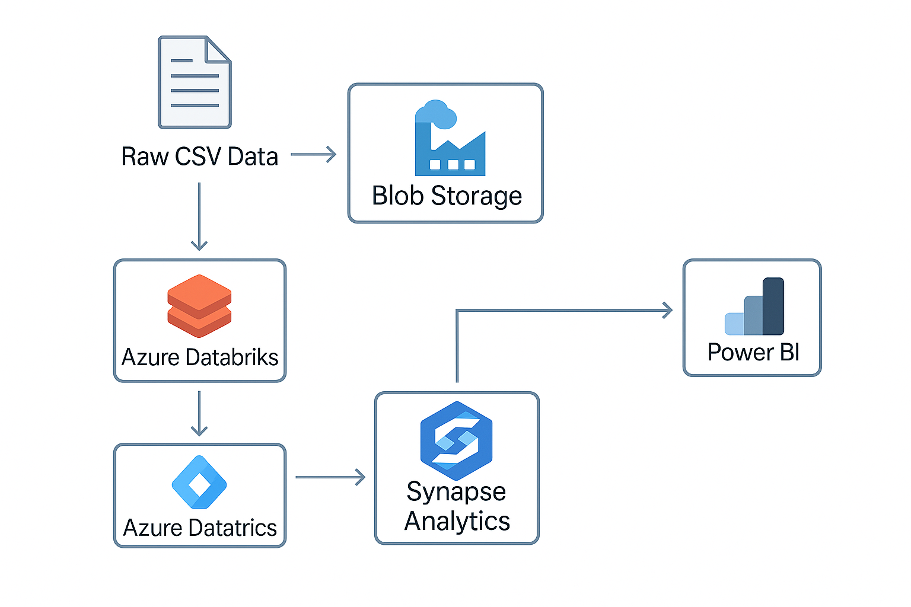

# 🚀 Azure Data Pipeline: Batch ETL Project

## 📌 Project Overview
This project demonstrates an end-to-end batch ETL pipeline built using Microsoft Azure services. It simulates the ingestion, transformation, and loading of structured data into a data warehouse using a modern, cloud-native architecture.

---

## 🔧 Technologies Used
- **Azure Data Factory** – For orchestrating the ETL workflow
- **Azure Blob Storage** – For raw data ingestion
- **Azure Databricks** – For data cleaning and transformation using PySpark
- **Azure Synapse Analytics** – For storing and querying the processed data
- **Power BI** – For dashboarding and visualization (optional enhancement)

---

## 📂 Pipeline Flow

---

## 📁 Dataset Used
> `customers.csv` – A sample dataset with customer details such as ID, name, location, and purchase history. (Stored in the `input/` folder on Blob Storage)

---

## 📜 ETL Steps

1. **Ingestion**:
   - ADF copies the file from Blob Storage to a staging area.

2. **Transformation**:
   - Databricks notebook cleans null values, standardizes fields, and adds new calculated columns.

3. **Loading**:
   - Clean data is written to a Synapse SQL table in a dedicated schema.

4. **(Optional) Visualization**:
   - A Power BI report connects to Synapse and displays key KPIs.

---

## 📊 Sample Use Case
A retail business wants to understand customer purchase trends and identify high-value customers. This pipeline automates data collection and reporting for actionable insights.

---
## 🖼️ Pipeline Architecture Diagram

## 👨‍💻 Author
**Saikumar Bigala**  
📧 bigalasaikumar@gmail.com  
🔗 [LinkedIn](https://www.linkedin.com/in/saikumar-bigala)  
🌐 [Portfolio Website](https://saikumar-bigala-tech-hub.lovable.app/)

---

## 💡 Future Enhancements
- Add real-time streaming using Event Hub
- Implement CI/CD with GitHub Actions
- Integrate with Azure Purview for data governance

---

## ✅ License
This project is licensed under the MIT License.
